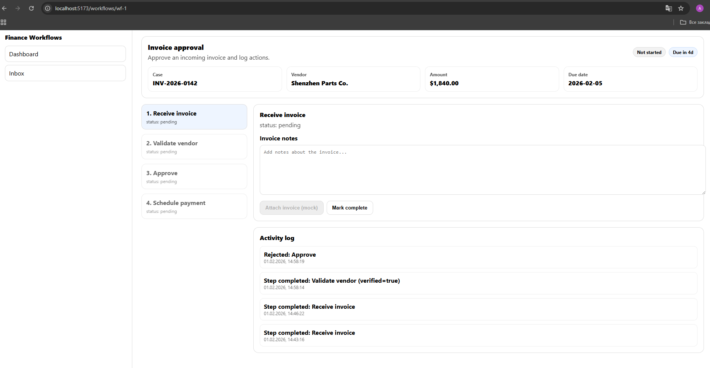

# Finance Workflows Dashboard (React + Vite)

Frontend demo of a finance / business workflow system.
Shows workflows, steps, step-specific actions and activity log.
State is stored locally (no backend yet).

## Features

- Workflow list (Dashboard)
- Workflow details page
- Step-by-step process (Receive → Validate → Approve → Schedule)
- Step-specific forms and actions
- Reject / blocked flow
- Activity log (audit trail)
- Inbox view
- Local persistence (in-memory / localStorage)

## Tech Stack

- React
- TypeScript
- Vite
- React Router
- Local state (no backend yet)

## Setup

```bash
npm install
npm run dev
```

## API

Должен быть запущен на https://finance-workflows-homejob-aocwesc5k-alexs-projects-cb770374.vercel.app/

## Screenshots


